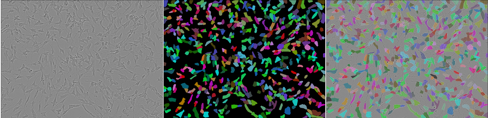
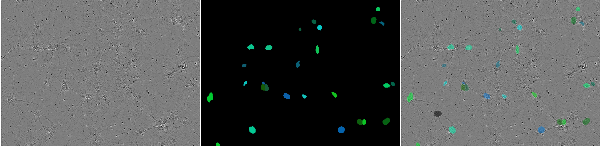

# Kaggle Competition: Sartorius Cell Instance Segmentation

Solution of Sartorius Cell Instance Segmentation competition by 
[Shamil Arslanov](https://github.com/homomorfism) and 
[Maxim Faleev](https://github.com/implausibleDeniability)

- [Project workflow](https://shamil-arslanov.notion.site/Cell-Instance-Segmentation-f5a291c7ffc34559927d2dedb8405c14)
- [kaggle competition overview](https://www.kaggle.com/c/sartorius-cell-instance-segmentation/)




*Types of cells from top to bottom: shsy5y, astro, cort*

## Contents
- **Mask R-CNN**  
    The initial model we've used was Mask R-CNN. 
    The model was trained with **pytorch**.
    For the usage example, see the instructions in section below.
- **Cascade R-CNN**  
    Cascade R-CNN was trained through **mmdetection** library.
    All necessary data transformation, model architecture, training and inference
    scripts are available at `mmdetection_training/`
- **Transfer Learning**  
    The organizers of the dataset supply large dataset with various types of cells. 
    The dataset was used for transfer learning, see `src/pretrain.py`
- **Hyperparameters optimization**  
    Hyperparameters were optimized with **optuna**. 
    Optimization scripts, config template and instructions are in `finetuning_parameters/`
- **Postprocessing optimization**  
    Postprocessing of the NN output includes non-maximal suppression, removal of overlapping pixels, 
    and other transformations. Parameters for these transformations can be optimzed through 
    `thresholds_optimization.py`. Results are available in `thresolds/`
- **Exploratory Data Analysis**  
    All EDA performed during the competition is available in `jupyter-notebooks/`
    
## How to download data

- `cd data/`
- `kaggle competitions download -c sartorius-cell-instance-segmentation`
- `unzip sartorius-cell-instance-segmentation.zip`

## How to run training script

1. Download data (see instructions below)
2. Rename `.env.example` file to `.env` and specify paths for dataset and weights storage
3. Run `pip install -r requirements.txt` for installing needed packages
4. Run training by command  
```
PYTHONPATH=. python src/train_val_mask_rcnn.py --device cuda:0 --exp_name init-training
```

## Troubleshooting

- `ModuleNotFoundError...` - add root folder of repository by running `export PYTHONPATH=$PYTHONPATH:/path/to/repo`

