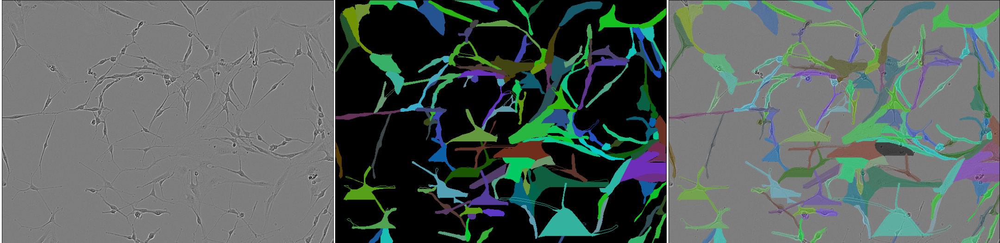

# Kaggle Competition: Sartorius Cell Instance Segmentation

*Types of cells from top to bottom: astro, cort, shsy5y*

## Description

This repository contains scripts for training and tuning instance segmentation models, used in kaggle competition.

## How to run training script

1. Download data (see instructions below)
2. Rename `.env.example` file to `.env` and specify paths for dataset and weights storage
3. Run `pip install -r requirements.txt` for installing needed packages
4. Run training by command `python train_val_mask_rcnn.py --device cuda:0 --exp_name init-training`

## Additional information

### Links

- kaggle competition overview: [kaggle.com](https://www.kaggle.com/c/sartorius-cell-instance-segmentation/)
- state of the project: [notion.so](https://www.notion.so/Kaggle-Instance-Segmentation-f5a291c7ffc34559927d2dedb8405c14)

### Troubleshooting

- `ModuleNotFoundError...` - add root folder of repository by running `export PYTHONPATH=$PYTHONPATH:/path/to/repo`

### Downloading data from competition

- `cd data/`
- `kaggle competitions download -c sartorius-cell-instance-segmentation`
- `unzip sartorius-cell-instance-segmentation.zip`

## Authors of repository

- Maxim Faleev, [github.com](https://github.com/implausibleDeniability)
- Shamil Arslanov, [github.com](https://github.com/homomorfism)